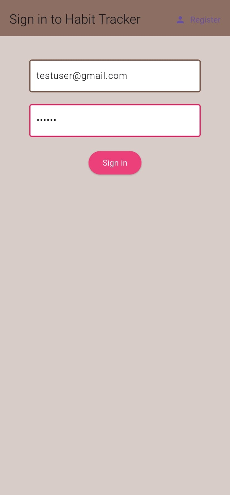
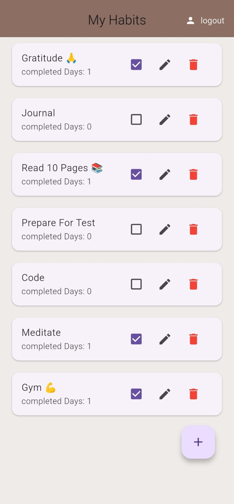
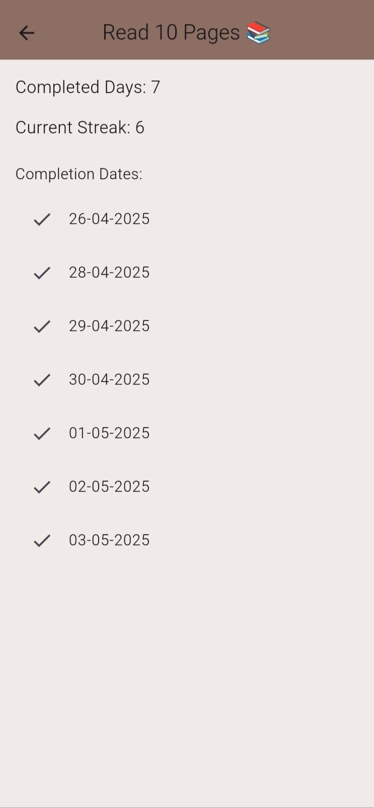

# Habit Tracker App

A simple Flutter app to track your daily habits.  
Built as a part of my Flutter learning journey.

## Features
- Create new habits
- Edit habit names
- Delete habits
- Mark habits as completed
- View streak and completed days
- View habit details on a separate screen

## Technologies Used
- Flutter
- Dart
- Firebase Firestore (for cloud database)
- Firebase Authentication

## Setup Instructions
1. Clone the repository:
   ```bash
   git clone https://github.com/sameer-dev2025/Habit-Tracker-app

2. Open the project in VS Code or Android Studio.


3. Install dependencies:

   flutter pub get


4. Set up Firebase:

   Connect this app to your own Firebase project.

   Enable Authentication (Email/Password).

   Set up Cloud Firestore database.


5. Run the app on emulator or real device:

   flutter run


## Screenshots





Future Improvements

- Add Notifications/reminders for habits

- Add Dark Mode

- Add animations for smoother UI


About Me
I'm a Flutter developer passionate about building simple, useful apps.
This Habit Tracker project is part of my learning journey to step into real-world development and start my professional career.


License
This project is open for learning purposes.
Feel free to fork, clone, and build your own habit tracker!
